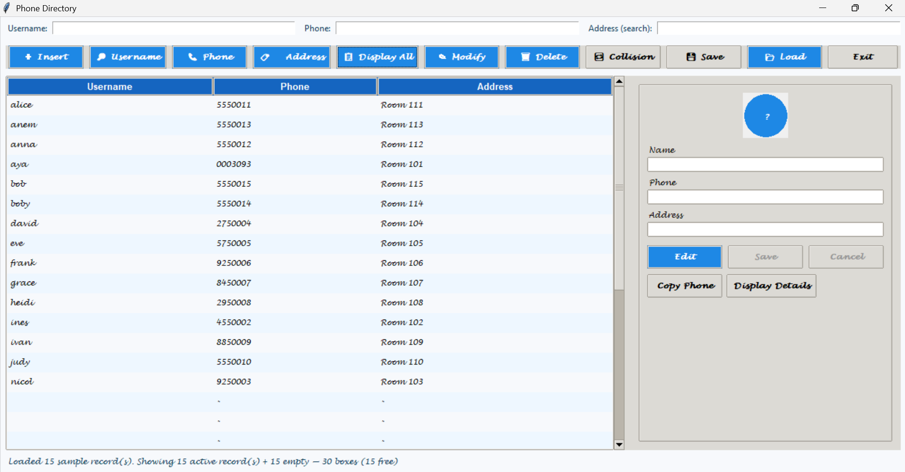
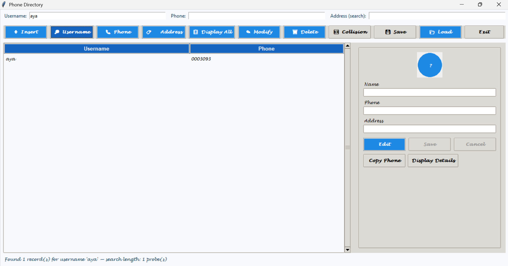
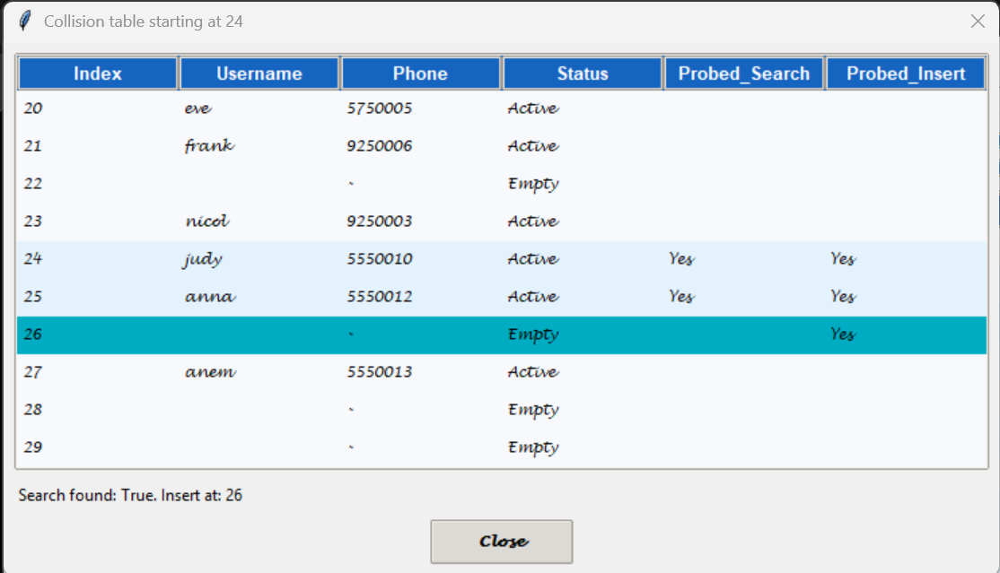

# Hash Table Phone Directory

## Overview

Hash Table Phone Directory is a data-structures and algorithms project implemented as a Python desktop application. It demonstrates a custom open-addressing hash table while providing functionality for storing, searching, editing, deleting, and persisting contact records through a Tkinter graphical interface.

The project is intentionally implemented with Python standard-library modules and does not depend on an external database or hash-table package.

## Main Features

- Insert contacts with a username, phone number, and address.
- Search by username, phone number, or address.
- Display and sort directory records in a table.
- Edit and delete selected contacts.
- Detect duplicate usernames and phone numbers during modification.
- Visualize hash-table probing and collision locations.
- Save active records to CSV and load them from CSV.
- Load a built-in sample dataset for demonstration.

## Data Structures and Algorithms

- `Record` objects store a contact's username, phone number, address, and deletion state.
- `HashTable` stores records in a fixed array of 30 slots.
- `Directory` maintains two synchronized hash tables:
  - one indexed by username;
  - one indexed by phone number.
- The GUI uses a Tkinter `ttk.Treeview` to display directory records.
- Sorting the visible table uses Python's built-in sorting operations.
- Address search scans active records and performs a case-insensitive substring comparison.

## Custom Hash-Table Implementation

The hash function sums the Unicode code points of the key characters and reduces the result modulo the table capacity:

```text
hash(key) = sum(ord(character) for character in key) % 30
```

The table uses open addressing with linear probing. When the initial slot is occupied, insertion checks the following slots sequentially, wrapping around at the end of the array. The number of examined slots is returned as a probe count.

Search follows the same probe sequence. It stops when it finds the requested record or reaches a genuinely empty slot. Deleted slots are represented by records marked as deleted, so searches continue through them and insertions can reuse them. The directory considers itself full when either synchronized table has 30 active records; deleting a record reduces the active count and makes the deleted slot available for later insertion.

The `Directory` class inserts the same contact into both indexes. When a record is deleted or modified, the old entry is removed from both tables and a new entry is inserted into both tables. Modification checks for duplicate usernames and phone numbers before replacing the record and attempts to restore the original record if reinsertion cannot be completed.

## Search Behavior

- **Username search:** case-insensitive exact matching.
- **Phone-number search:** exact string matching in the phone-number table.
- **Address search:** case-insensitive substring matching over active records in the username table.

The low-level search operation also reports the number of probes used to locate or reject a key.

## Learning Objectives

This project demonstrates:

- converting keys into array positions through hashing;
- open addressing and linear probing for collision resolution;
- deletion with tombstones so probe chains remain searchable;
- maintaining synchronized indexes for different lookup keys;
- CSV persistence and reconstruction of the in-memory indexes.

## GUI Functionality

The Tkinter interface provides:

- input fields for username, phone number, and address searches;
- buttons for insertion, username/phone/address searches, display, modification, deletion, collision inspection, saving, and loading;
- a `Treeview` showing the current records;
- a detail panel for viewing and editing the selected contact;
- collision/probing visualization for inspecting hash-table positions and probe sequences.
- keyboard shortcuts for common actions such as display, save, load, and insert.

The address is stored with each record and can be shown in the full directory view and detail panel.

## CSV Persistence

CSV files contain one active contact per row in this order:

```text
username,phone,address
```

The application writes active records from the username index. When a CSV file is loaded, the username table is rebuilt and the phone-number index is reconstructed from the loaded records.

## Project Structure

```text
.
├── app.py
├── tests/
│   ├── test_address_search.py
│   ├── test_ops.py
│   ├── test_search_case.py
│   ├── test_sort.py
│   └── test_ui_smoke.py
├── screenshots/
│   ├── main-interface.png
│   ├── search-result.png
│   └── collision-visualization.png
├── .gitignore
└── README.md
```

## Running the Application

From the repository root:

```bash
python app.py
```

The application opens a Tkinter window. The directory starts empty; use **Display All** to load the built-in sample records.

## Running the Tests

Run the retained tests as modules from the repository root:

```bash
python -m tests.test_ops
python -m tests.test_search_case
python -m tests.test_sort
python -m tests.test_address_search
python -m tests.test_ui_smoke
```

The GUI smoke test requires a working Tkinter display environment.

## Technologies Used

- Python 3
- Tkinter and `tkinter.ttk` for the desktop GUI
- Python `csv` module for persistence
- Python lists as fixed-size hash-table storage
- Custom character-sum hashing, open addressing, and linear probing
- Case-insensitive string comparison and substring search
- Built-in sorting for the displayed records

## Screenshots






